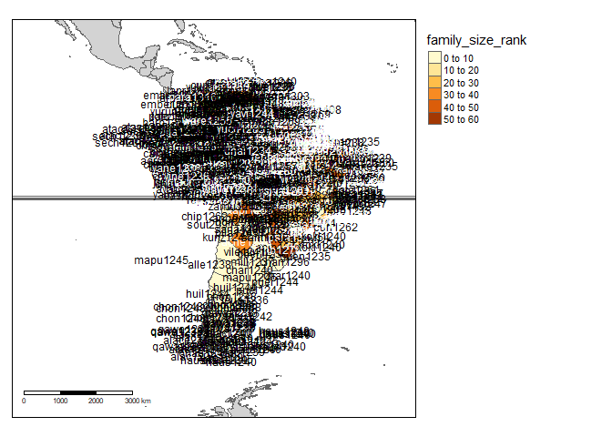
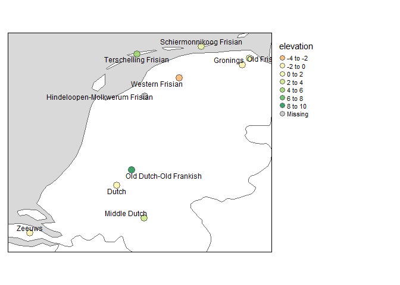

<!-- README.md is generated from README.Rmd. Please edit that file -->

# glottospace

<!-- badges: start -->

[](https://lifecycle.r-lib.org/articles/stages.html#experimental)
<!-- badges: end -->

## R package for the geospatial analysis of linguistic and cultural data.

    Examples include: matching linguistic datasets to their location, 
    calculating distances between languages based on their spatial location or linguistic features, 
    visualizing linguistic data on a map.

## Installation

You can install the development version of glottospace from
[GitHub](https://github.com/) with:

``` r
# install.packages("devtools")
devtools::install_github("SietzeN/glottospace")
```

## Introduction to glottospace

### Plotting language locations on a map

Imagine you’re working with languages in a particular region, and want
to visualize them on a map. With glottospace this is easy! You could for
example filter all languages in South America, and show which ones of
them are isolate languages:

``` r
library(glottospace)

## Plot point data:
glottomap(continent = "South America", color = "isolate")
```


Languages are often represented with points, while in reality the
speakers of a language can inhabit vast areas. Glottospace works with
point and polygon data. When polygon data is not available, you can
interpolate the points and plot those.

``` r
## Filter by continent
glottopoints <- glottofilter(continent = "South America")
# Interpolate points to polygons:
glottopols <- points2pols(glottopoints, method = "voronoi", continent = "South America")
# Plot polygon data:
glottomap(glottodata = glottopols, color = "family_size_rank")
```



### Adding contextual data for specific languages

Imagine you are interested in a particular set of languages, and want to
add some contextual information.

``` r
# Search languages:
glottosearch(find = "Dutsch")
#> Simple feature collection with 6 features and 14 fields
#> Geometry type: POINT
#> Dimension:     XY
#> Bounding box:  xmin: -58.5626 ymin: -4.19566 xmax: 152.183 ymax: 52.16
#> Geodetic CRS:  WGS 84
#>      glottocode family_id parent_id                   name isocode
#> 763    berb1259  indo1319  zeeu1239   Berbice Creole Dutch     brc
#> 1681   dutc1256  indo1319  glob1241                  Dutch     nld
#> 4263   midd1321  indo1319  midd1347           Middle Dutch     dum
#> 5155   oldd1237  indo1319  macr1270 Old Dutch-Old Frankish     odt
#> 6163   skep1238  indo1319  zeeu1239     Skepi Creole Dutch     skw
#> 7044   unse1236  indo1319  glob1243           Unserdeutsch     uln
#>      child_dialect_count                      country_ids   family_name isolate
#> 763                    0                               GY Indo-European   FALSE
#> 1681                  12 AW BE BQ BR CW DE GF GY NL SR SX Indo-European   FALSE
#> 4263                   0                               NL Indo-European   FALSE
#> 5155                   2                               NL Indo-European   FALSE
#> 6163                   0                               GY Indo-European   FALSE
#> 7044                   0                            AU PG Indo-European   FALSE
#>      family_size family_size_rank     country     continent         region
#> 763          583               55      Guyana South America  South America
#> 1681         583               55 Netherlands        Europe Western Europe
#> 4263         583               55 Netherlands        Europe Western Europe
#> 5155         583               55 Netherlands        Europe Western Europe
#> 6163         583               55      Guyana South America  South America
#> 7044         583               55        <NA>          <NA>           <NA>
#>                      geometry
#> 763   POINT (-58.0002 5.3829)
#> 1681             POINT (5 52)
#> 4263      POINT (5.34 51.656)
#> 5155        POINT (5.2 52.16)
#> 6163 POINT (-58.5626 6.05191)
#> 7044 POINT (152.183 -4.19566)
```

There are 6 glots that resemble our search term. Let’s check on
[glottolog](https://glottolog.org/) if Dutch is the language we’re
looking for.

``` r
glottocode_online("dutc1256")
```

Yes, that’s the one. Let’s check where Dutch is located in comparison to
other languages in the Netherlands.

``` r
dutchies <- glottofilter(country = "Netherlands")
```

Get and extract environmental data.

``` r
elevation <- get_geodata(download = "elevation", country = "Netherlands")
#> Warning in showSRID(uprojargs, format = "PROJ", multiline = "NO", prefer_proj
#> = prefer_proj): Discarded datum Unknown based on WGS84 ellipsoid in Proj4
#> definition
elevdutchies <- extractgeodata(glottodata = dutchies, geodata = elevation)
#> geodata extracted
```

Let’s plot the elevation of the Dutchies:

``` r
glottomap(glottodata = elevdutchies, color = "elevation", label = "name", ptsize = 0.85)
#> Variable(s) "elevation" contains positive and negative values, so midpoint is set to 0. Set midpoint = NA to show the full spectrum of the color palette.
```



## Workflow of glottospace

The glottospace package offers several function families to work with
spatio-linguistic data:

1.  glottoget: download glottodata from online sources, or load
    user-provided glottodata.

2.  glottocreate: create empty glottodata structure, to add data
    manually.

3.  glottocheck: run interactive quality checks of user-provided
    glottodata.

4.  glottoclean: clean-up glottodata.

5.  glottoboost: upgrade glottodata.

6.  glottojoin: join user-provided glottodata with other (often online)
    datasets.

7.  glottosearch: search [glottolog](https://glottolog.org/) database
    for languages, language families, glottocodes, etc.

8.  glottofilter: filter/subset glottodata based on linguistic and
    geographic features/variables.

9.  glottodist: calculate differences/similarities between languages
    based on their features (linguistic, cultural, environmental,
    geographic, etc.).

10. glottoplot: visualizing differences/similarities between languages.

11. glottospace: make glottodata spatial, add coordinates, add spatial
    points or polygons to languages.

12. geoget: download geographic data from online sources, or load
    user-provided geographic data.

13. geotools: extract environmental data and add those to glottodata.

14. geodist: calculate geographic distances between languages.

15. glottomap: visualize linguistic and cultural data on a map.

16. glottosave: save output generated by glottospace (data, figures,
    maps, etc.).

### glottoget

You can download glottodata from online sources or load locally stored
glottodata (for example from an excel file or shapefile). In the example
below, no filename is specified, therefore a dummy dataset is loaded.

``` r
glottodata <- glottoget()
head(glottodata)
#>   glottocode var001 var002 var003
#> 1   yucu1253      Y      a      N
#> 2   tani1257   <NA>      b      Y
```

### glottocreate

You can generate empty data structures that help you to add your own
data in a structured way.

``` r
createglottodata(glottocodes = c("yucu1253", "tani1257"), variables = 3, meta = FALSE)
#>   glottocode var001 var002 var003
#> 1   yucu1253     NA     NA     NA
#> 2   tani1257     NA     NA     NA
```

I’ve specified meta = FALSE, to indicate that we want to generate a
‘flat’ glottodata table. However, when creating glottodata, by default,
several meta tables are included:

``` r
glottodata_meta <- createglottodata(glottocodes = c("yucu1253", "tani1257"), variables = 3)
summary(glottodata_meta)
#>            Length Class      Mode
#> glottodata 4      data.frame list
#> structure  6      data.frame list
#> metadata   6      data.frame list
#> references 7      data.frame list
#> readme     2      data.frame list
#> lookup     2      data.frame list
```

The majority of these metatables are added for the convenience of the
user. The ‘structure’ table is the only one that is required for some of
the functions in the glottospace package. A structure table can also be
added later:

``` r
create_structuretable(glottocodes = c("yucu1253", "tani1257"), varnames = c("var001", "var002", "var003"))
#>   varname type levels weight groups subgroups
#> 1  var001   NA     NA      1     NA        NA
#> 2  var002   NA     NA      1     NA        NA
#> 3  var003   NA     NA      1     NA        NA
```

More complex glottodata structures can also be generated. For example,
in cases where you want to distinguish between groups within each
language.

``` r
# Instead of creating a single table for all languages, you might want to create a list of tables (one table for each language)
createglottosubdata(glottocodes = c("yucu1253", "tani1257"), variables = 3, groups = c("a", "b"), n = 2, meta = FALSE)
#> $yucu1253
#>     glottosubcode var001 var002 var003
#> 1 yucu1253_a_0001     NA     NA     NA
#> 2 yucu1253_a_0002     NA     NA     NA
#> 3 yucu1253_b_0001     NA     NA     NA
#> 4 yucu1253_b_0002     NA     NA     NA
#> 
#> $tani1257
#>     glottosubcode var001 var002 var003
#> 1 tani1257_a_0001     NA     NA     NA
#> 2 tani1257_a_0002     NA     NA     NA
#> 3 tani1257_b_0001     NA     NA     NA
#> 4 tani1257_b_0002     NA     NA     NA
```

### glottocheck

If you have your own data, you might want to do some interactive quality
checks:

``` r
glottodata <- glottoget()
glottocheck(glottodata, diagnostic = FALSE)
#> No missing IDs
#> No duplicate IDs.
#> All variables have two or more levels (excluding NA)
#> All IDs are valid glottocodes
#> Some columns have missing data.
#> Some rows have missing data.
```

I’ve now specified diagnostic = FALSE, but the default is to show some
more extensive diagnostics (like a data coverage plot).

You can also check the metadata:

``` r
glottodata <- glottoget(meta = TRUE)
checkmetadata(glottodata)
#> This glottodataset contains the folowing tables: glottodata, structure, metadata, references, readme, lookup
#> All types recognized
#> All weights are specified
```

### glottoclean

Once you’ve loaded glottodata, you might encounter some inconsistencies.
For example, data-contributors might not have used a standardized way of
coding missing values.

``` r
glottodata <- glottoget(meta = TRUE)
glottodata$structure
#>   varname   type levels weight groups subgroups
#> 1  var001   symm     NA      1     NA        NA
#> 2  var002 factor     NA      1     NA        NA
#> 3  var003   symm     NA      1     NA        NA
# glottodata <- glottoclean(glottodata)
```

### glottoboost

Upgrade data.

### glottojoin

Join user-provided glottodata with other dataset., and integrating them
to use their full potential.

### glottosearch

search: search languages

### glottofilter

filter, select, query

### glottodist

Quantify differences and similarities between languages glottodistances:
calculating similarities between languages based on linguistic/cultural
features

### glottoplot

Visualizing differences (distances) between languages based on
linguistic, cultural, and environmental features.

### glottospace

ff

### geoget

dd

## geotools

..

### geodist

geodistances: calculate distances between languages, nearest languages,
etc.

### glottomap

Visualizing linguistic and cultural data on a map

### glottosave

Save output generated by glottospace (data, figures, maps, etc.). Output
that has been exported from the glottospace package can be read from
other software package, or loaded again with getglottodata.

## Some basic concepts: data formats

The glottospace package has three built-in datasets: glottobase,
glottospace, and userdata.

``` r
data(package = "glottospace")
```

1.  glottobase: This is a boosted/enriched version of
    [glottolog](https://glottolog.org/) data. It is used as reference
    dataset in several functions. The glottocodes are used as unique IDs
    to match different data sources.

``` r
data("glottobase")
# For more information about glottobase
?glottobase
colnames(glottobase)
#>  [1] "glottocode"          "family_id"           "parent_id"          
#>  [4] "name"                "isocode"             "child_dialect_count"
#>  [7] "country_ids"         "family_name"         "isolate"            
#> [10] "family_size"         "family_size_rank"    "country"            
#> [13] "continent"           "region"              "geometry"
```

2.  glottospace. A simple dataset with glottocodes and a geometry colum.
    The glottocodes are used to match a language to a location.

``` r
glottospace <- get_glottospace()
head(glottospace)
#> Simple feature collection with 6 features and 1 field
#> Geometry type: POINT
#> Dimension:     XY
#> Bounding box:  xmin: 36.5721 ymin: -9.03389 xmax: 146.992 ymax: 5.95034
#> Geodetic CRS:  WGS 84
#>   glottocode                  geometry
#> 1   aari1239   POINT (36.5721 5.95034)
#> 2   aasa1238  POINT (36.8648 -4.00679)
#> 3   abad1241  POINT (146.992 -9.03389)
#> 4   abag1245  POINT (145.665 -6.12028)
#> 5   abai1240   POINT (118.306 5.55394)
#> 6   abai1241 POINT (116.1625 3.524226)
```

3.  userdata. This is user-provided data that consist of a glottocode
    and any number of linguistic and/or cultural variables (features).

``` r
glottodata <- get_glottodata(meta = FALSE)
glottodata
```
