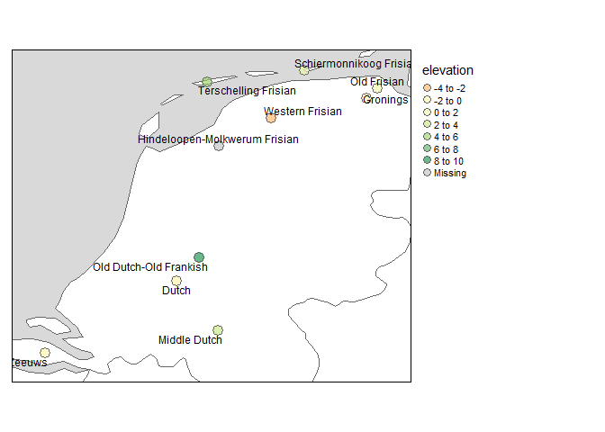
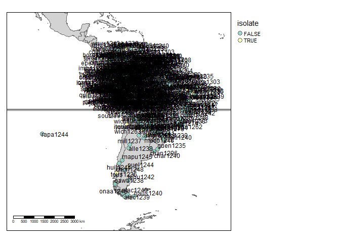

<!-- README.md is generated from README.Rmd. Please edit that file -->

# glottospace

<!-- badges: start -->

[](https://lifecycle.r-lib.org/articles/stages.html#experimental)
<!-- badges: end -->

## R package for the geospatial analysis of linguistic and cultural data.

    Examples include: matching linguistic datasets to their location, 
    calculating distances between languages based on their spatial location or linguistic features, 
    visualizing linguistic data on a map.

## Installation

You can install the development version of glottospace from
[GitHub](https://github.com/) with:

``` r
# install.packages("devtools")
devtools::install_github("SietzeN/glottospace")
```

## Introduction to glottospace

### Plotting language locations on a map

Imagine you’re working with languages in a particular region, and want
to visualize them on a map. With glottospace this is easy! You could for
example filter all languages in South America, and show which ones of
them are isolate languages:

``` r
library(glottospace)

## Plot point data:
glottomap(continent = "South America", color = "isolate")
```


Languages are often represented with points, while in reality the
speakers of a language can inhabit vast areas. Glottospace works with
point and polygon data. When polygon data is not available, you can
interpolate the points and plot those.

``` r
## Filter by continent
glottopoints <- glottofilter(continent = "South America")
# Interpolate points to polygons:
glottopols <- glottospace(glottopoints, method = "voronoi", continent = "South America")
# Plot polygon data:
glottomap(glottodata = glottopols, color = "family_size_rank")
```


### Adding contextual data for specific languages

Imagine you are interested in a particular set of languages, and want to
add some contextual information.

``` r
# Search languages:
glottosearch(find = "chicom")
#> Simple feature collection with 1 feature and 14 fields
#> Geometry type: POINT
#> Dimension:     XY
#> Bounding box:  xmin: -91.2869 ymin: 15.6078 xmax: -91.2869 ymax: 15.6078
#> Geodetic CRS:  WGS 84
#>      glottocode family_id parent_id          name isocode child_dialect_count
#> 1269   chic1271  maya1287  huas1241 Chicomuceltec     cob                   0
#>      country_ids family_name isolate family_size family_size_rank   country
#> 1269       GT MX       Mayan   FALSE          33               26 Guatemala
#>          continent          region                 geometry
#> 1269 North America Central America POINT (-91.2869 15.6078)
```

There are 6 languages that resemble our search term. Let’s check on
[glottolog](https://glottolog.org/) if Shuar is the language we’re
looking for.

``` r
glottocode_online("shua1257")
```

Yes, that’s the one. Let’s check where Shuar is located in comparison to
other languages in Peru.

``` r
peruvians <- glottofilter(country = "Peru")
```

Get and extract environmental data.

``` r
elevation <- geoget(download = "elevation", country = "Peru")
#> Warning in showSRID(uprojargs, format = "PROJ", multiline = "NO", prefer_proj
#> = prefer_proj): Discarded datum Unknown based on WGS84 ellipsoid in Proj4
#> definition
# Let's make a map:
geomap(elevation)
```


``` r
# Extract elevation for each language
elevperuvians <- extractgeodata(glottodata = peruvians, geodata = elevation)
#> geodata extracted
```

Let’s plot the elevation of the Dutchies:

``` r
glottomap(glottodata = elevperuvians, color = "elevation", ptsize = 0.85)
```



## Workflow of glottospace

The glottospace package offers several function families to work with
spatio-linguistic data:

1.  glottoget: download glottodata from online sources, or load
    user-provided glottodata.

2.  glottocreate: create empty glottodata structure, to add data
    manually.

3.  glottocheck: run interactive quality checks of user-provided
    glottodata.

4.  glottoclean: clean-up glottodata.

5.  glottojoin: join user-provided glottodata with other (often online)
    datasets.

6.  glottosearch: search [glottolog](https://glottolog.org/) database
    for languages, language families, glottocodes, etc.

7.  glottofilter: filter/subset glottodata based on linguistic and
    geographic features/variables.

8.  glottodist: calculate differences/similarities between languages
    based on their features (linguistic, cultural, environmental,
    geographic, etc.).

9.  glottoplot: visualizing differences/similarities between languages.

10. glottospace: make glottodata spatial, add coordinates, add spatial
    points or polygons to languages.

11. geoget: download geographic data from online sources, or load
    user-provided geographic data.

12. geotools: extract environmental data and add those to glottodata.

13. geodist: calculate geographic distances between languages.

14. glottomap: visualize linguistic and cultural data on a map.

15. glottosave: save output generated by glottospace (data, figures,
    maps, etc.).

### glottoget

You can load locally stored glottodata (for example from an excel file
or shapefile). In the example below, no filename is specified, therefore
a dummy dataset is loaded.

``` r
glottodata <- glottoget()
head(glottodata)
#>   glottocode var001 var002 var003
#> 1   yucu1253      Y      a      N
#> 2   tani1257   <NA>      b      Y
```

You can also load glottodata from online databases such as
[glottolog](https://glottolog.org/). You can download a raw version of
the data (‘glottolog’), or an enriched/boosted version (‘glottobase’):

``` r
# Two ways to load glottobase:
data("glottobase")
glottobase <- glottogetbase("glottobase")
# For more information about glottobase
?glottobase
colnames(glottobase)
#>  [1] "glottocode"          "family_id"           "parent_id"          
#>  [4] "name"                "isocode"             "child_dialect_count"
#>  [7] "country_ids"         "family_name"         "isolate"            
#> [10] "family_size"         "family_size_rank"    "country"            
#> [13] "continent"           "region"              "geometry"
```

### glottocreate

You can generate empty data structures that help you to add your own
data in a structured way.

``` r
createglottodata(glottocodes = c("yucu1253", "tani1257"), variables = 3, meta = FALSE)
#>   glottocode var001 var002 var003
#> 1   yucu1253     NA     NA     NA
#> 2   tani1257     NA     NA     NA
```

I’ve specified meta = FALSE, to indicate that we want to generate a
‘flat’ glottodata table. However, when creating glottodata, by default,
several meta tables are included:

``` r
glottodata_meta <- createglottodata(glottocodes = c("yucu1253", "tani1257"), variables = 3)
summary(glottodata_meta)
#>            Length Class      Mode
#> glottodata 4      data.frame list
#> structure  6      data.frame list
#> metadata   6      data.frame list
#> references 7      data.frame list
#> readme     2      data.frame list
#> lookup     2      data.frame list
```

The majority of these metatables are added for the convenience of the
user. The ‘structure’ table is the only one that is required for some of
the functions in the glottospace package. A structure table can also be
added later:

``` r
create_structuretable(glottocodes = c("yucu1253", "tani1257"), varnames = c("var001", "var002", "var003"))
#>   varname type levels weight groups subgroups
#> 1  var001   NA     NA      1     NA        NA
#> 2  var002   NA     NA      1     NA        NA
#> 3  var003   NA     NA      1     NA        NA
```

More complex glottodata structures can also be generated. For example,
in cases where you want to distinguish between groups within each
language.

``` r
# Instead of creating a single table for all languages, you might want to create a list of tables (one table for each language)
createglottosubdata(glottocodes = c("yucu1253", "tani1257"), variables = 3, groups = c("a", "b"), n = 2, meta = FALSE)
#> $yucu1253
#>     glottosubcode var001 var002 var003
#> 1 yucu1253_a_0001     NA     NA     NA
#> 2 yucu1253_a_0002     NA     NA     NA
#> 3 yucu1253_b_0001     NA     NA     NA
#> 4 yucu1253_b_0002     NA     NA     NA
#> 
#> $tani1257
#>     glottosubcode var001 var002 var003
#> 1 tani1257_a_0001     NA     NA     NA
#> 2 tani1257_a_0002     NA     NA     NA
#> 3 tani1257_b_0001     NA     NA     NA
#> 4 tani1257_b_0002     NA     NA     NA
```

### glottocheck

If you have your own data, you might want to do some interactive quality
checks:

``` r
glottodata <- glottoget()
glottocheck(glottodata, diagnostic = FALSE)
#> No missing IDs
#> No duplicate IDs.
#> All variables have two or more levels (excluding NA)
#> All IDs are valid glottocodes
#> Some columns have missing data.
#> Some rows have missing data.
```

I’ve now specified diagnostic = FALSE, but the default is to show some
more extensive diagnostics (like a data coverage plot).

You can also check the metadata:

``` r
glottodata <- glottoget(meta = TRUE)
checkmetadata(glottodata)
#> This glottodataset contains the folowing tables: glottodata, structure, metadata, references, readme, lookup
#> All types recognized
#> All weights are specified
```

### glottoclean

Once you’ve loaded glottodata, you might encounter some inconsistencies.
For example, data-contributors might not have used a standardized way of
coding missing values.

``` r
glottodata <- glottoget(meta = TRUE)
glottodata$structure
#>   varname   type levels weight groups subgroups
#> 1  var001   symm     NA      1     NA        NA
#> 2  var002 factor     NA      1     NA        NA
#> 3  var003   symm     NA      1     NA        NA
# glottodata <- glottoclean(glottodata)
```

### glottojoin

Join user-provided glottodata with other datasets, or with online
databases.

``` r
# Join with glottospace
glottodata <- glottoget()
glottodatabase <- glottojoin(glottodata, with = "glottobase")
glottodataspace <- glottojoin(glottodata, with = "glottospace")

# Join with a dist object
dist <- geodist(glottodataspace)
glottodatadist <- glottojoin(glottodata, with = dist)

# Join a list of glottodata tables into a single table
glottodatalist <- createglottosubdata(glottocodes = c("yucu1253", "tani1257"), variables = 3, groups = c("a", "b"), n = 2, meta = FALSE)
glottodatatable <- glottojoin(glottodata = glottodatalist)
```

### glottosearch

As demonstrated in the example above, you can search glottodata for a
specific search term

You can search for a match in all columns:

``` r
glottosearch(find = "yurakar")[,"name"]
#> Simple feature collection with 1 feature and 1 field
#> Geometry type: POINT
#> Dimension:     XY
#> Bounding box:  xmin: -65.1224 ymin: -16.7479 xmax: -65.1224 ymax: -16.7479
#> Geodetic CRS:  WGS 84
#>          name                  geometry
#> 7701 Yuracaré POINT (-65.1224 -16.7479)
```

Or limit the search to specific columns:

``` r
glottosearch(find = "Yucuni", columns = c("name", "family_name"))[,"name"]
#> Simple feature collection with 2 features and 1 field
#> Geometry type: POINT
#> Dimension:     XY
#> Bounding box:  xmin: -97.91818 ymin: -0.76075 xmax: -71.0033 ymax: 17.23743
#> Geodetic CRS:  WGS 84
#>                   name                   geometry
#> 7687            Yucuna  POINT (-71.0033 -0.76075)
#> 7688 Yucunicoco Mixtec POINT (-97.91818 17.23743)
```

Sometimes you don’t find a match:

``` r
glottosearch(find = "matsigenka")[,"name"]
#> Simple feature collection with 0 features and 1 field
#> Bounding box:  xmin: NA ymin: NA xmax: NA ymax: NA
#> Geodetic CRS:  WGS 84
#> [1] name     geometry
#> <0 rows> (or 0-length row.names)
```

If you can’t find what you’re looking for, you can increase the
tolerance:

``` r
glottosearch(find = "matsigenka", tolerance = 0.2)[,"name"]
#> Simple feature collection with 1 feature and 1 field
#> Geometry type: POINT
#> Dimension:     XY
#> Bounding box:  xmin: -74.4371 ymin: -11.5349 xmax: -74.4371 ymax: -11.5349
#> Geodetic CRS:  WGS 84
#>               name                  geometry
#> 4862 Nomatsiguenga POINT (-74.4371 -11.5349)
```

Aha! There it is: ‘Machiguenga’

``` r
glottosearch(find = "matsigenka", tolerance = 0.4)[,"name"]
#> Simple feature collection with 12 features and 1 field
#> Geometry type: POINT
#> Dimension:     XY
#> Bounding box:  xmin: -74.4371 ymin: -14.9959 xmax: 166.738 ymax: 13.5677
#> Geodetic CRS:  WGS 84
#> First 10 features:
#>                    name                   geometry
#> 1735 Eastern Maninkakan   POINT (-10.5394 9.33048)
#> 3121    Kita Maninkakan   POINT (-9.49151 13.1798)
#> 3205   Konyanka Maninka   POINT (-8.89972 8.04788)
#> 3791   Maasina Fulfulde   POINT (-3.64763 11.1324)
#> 3808        Machiguenga  POINT (-72.5017 -12.1291)
#> 3964           Mandinka POINT (-15.65395 12.81652)
#> 4000          Mansoanka   POINT (-15.9202 12.8218)
#> 4106  Matigsalug Manobo     POINT (125.16 7.72124)
#> 4862      Nomatsiguenga  POINT (-74.4371 -11.5349)
#> 5462         Piamatsina   POINT (166.738 -14.9959)
```

### glottofilter

filter, select, query

``` r
eurasia <- glottofilter(continent = c("Europe", "Asia"))
wari <- glottofilter(glottodata = glottodata, glottocode = "wari1268")
indo_european <- glottofilter(glottodata = glottodata, family_name = 'Indo-European')
south_america <- glottofilter(glottodata = glottodata, continent = "South America")
colovenz <- glottofilter(glottodata = glottodata, country = c("Colombia", "Venezuela"))
# arawtuca <- glottofilter(glottodata = glottodata, expression = family_name %in% c("Arawakan", "Tucanoan"))
```

### glottodist

Quantify differences and similarities between languages glottodistances:
calculating similarities between languages based on linguistic/cultural
features

``` r
# In order to be able to calculate linguistic distances a structure table is required, that's why I specify meta = TRUE.
glottodata <- glottoget(meta = TRUE)
glottodist <- glottodist(glottodata = glottodata)
#> Warning in cluster::daisy(x = glottodata, metric = "gower", type = list(symm =
#> symm, : at least one binary variable has not 2 different levels.
#> Warning in min(x): no non-missing arguments to min; returning Inf
#> Warning in max(x): no non-missing arguments to max; returning -Inf
#> Warning in min(x): no non-missing arguments to min; returning Inf
#> Warning in max(x): no non-missing arguments to max; returning -Inf

# As we've seen above, in case you have glottodata without a structure table, you can add it:
glottodata <- glottoget(meta = FALSE)
structure <- create_structuretable()
glottodata <- glottodata_addtable(glottodata, structure, name = "structure")
```

### glottoplot

Visualizing differences (distances) between languages based on
linguistic, cultural, and environmental features.

``` r
glottodata <- glottoget(meta = TRUE)
glottodist <- glottodist(glottodata = glottodata)
#> Warning in cluster::daisy(x = glottodata, metric = "gower", type = list(symm =
#> symm, : at least one binary variable has not 2 different levels.
#> Warning in min(x): no non-missing arguments to min; returning Inf
#> Warning in max(x): no non-missing arguments to max; returning -Inf
#> Warning in min(x): no non-missing arguments to min; returning Inf
#> Warning in max(x): no non-missing arguments to max; returning -Inf
glottoplot(glottodist)
```


### glottospace

This family of functions turns glottodata into a spatial object. As I’ve
illustrated above, these can be either glottopoints or glottopols

``` r
glottodata <- glottoget()
glottospacedata <- glottospace(glottodata, method = "buffer", radius = 5)
#> Buffer created with a radius of 5 km.
# By default, the projection of maps is equal area, and shape is not preserved:
glottomap(glottospacedata)
```


### geoget

The geoget function supports both raster and vector formats. It either
loads spatial data from a local path, or downloads is from a remote
server.

``` r
climate <- geoget(download = "climate")[[12]]
names(climate) <- "precipitation"
geomap(climate)
```

 \#\# geotools
This is a large family of functions to work with spatial data. Most of
these however, will probably not be called directly by the users. I’ve
already demonstrated the function geodataextract() which can be used to
extract environmental data for languages. You can also use a buffer
radius to extract environmental features and summarize them. Here, I’m
using a buffer of 10 km and summarize by taking the mean.

``` r
dutchies <- glottofilter(country = "Netherlands")
climatedutchies <- extractgeodata(glottodata = dutchies, geodata = climate, radius = 10, fun = "mean")
#> Extracting values within a radius of 10 km.
#> geodata extracted
glottomap(climatedutchies, color = "precipitation_mean", ptsize = 1)
```


### geodist

geodistances: calculate distances between languages, nearest languages,
etc.

``` r
glottodata <- glottoget()
glottodataspace <- glottospace(glottodata)
geodist(points = glottodataspace)
#>          yucu1253
#> tani1257       71
```

### glottomap

With glottomap you can quickly visualize the location of languages.
Below I show simple static maps, but you can also create dynamic maps by
specifying type = “dynamic”.

You can pass arguments directly to glottofilter

``` r
glottomap(country = "Colombia")
```


However, you can also create maps with other glottodata. For example, we
might want to create a worldmap highlighting the largest language
families

``` r
glottodata <- glottogetbase()
families <- glottodata %>% dplyr::count(family_name, sort = TRUE)

# highlight 10 largest families:
glottodata <- glottospotlight(glottodata = glottodata, spotcol = "family_name", spotlight = families$family_name[1:10], spotcontrast = "family_name", bgcontrast = "family_name")

# Create map
glottomap(glottodata, color = "color")
```



### glottosave

All output generated with the glottospace package (data, figures, maps,
etc.) can be saved with a single command.

``` r
glottodata <- glottoget(meta = FALSE)
# Saves as .xlsx
glottosave(glottodata, filename = "glottodata")
#> Data.frame saved as glottodata.xlsx

glottospacedata <- glottospace(glottodata)
# Saves as .GPKG
glottosave(glottodata, filename = "glottodata")
#> Data.frame saved as glottodata.xlsx

glottomap <- glottomap(glottodata)
# By default, static maps are saved as .png, dynamic maps are saved as .html
glottosave(glottomap, filename = "glottomap")
#> Map saved to C:\Users\sjnor\surfdrive\PROJECTS_SN\SAPPHIRE\R\glottospace\glottomap.png
#> Resolution: 3373.408 by 1307.283 pixels
#> Size: 11.24469 by 4.357611 inches (300 dpi)
#> Map (tmap object) saved as glottomap.png
```
