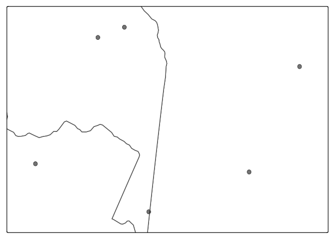

<!-- README.md is generated from README.Rmd. Please edit that file -->

# glottospace: Language Mapping and Geospatial Analysis of Linguistic and Cultural Data 

<!-- badges: start -->

[](https://lifecycle.r-lib.org/articles/stages.html#stable)
[](https://www.gnu.org/licenses/gpl-3.0)
[](https://github.com/glottospace/glottospace/actions)
[](https://joss.theoj.org/papers/c93a1ccb6835a15c6026ea1ddc28b50c)
[](https://r-pkg.org/pkg/glottospace)
[](https://github.com/glottospace/glottospace/actions/workflows/R-CMD-check.yaml)

<!-- badges: end -->

# Introduction

The **glottospace** package facilitates the geospatial analysis of
linguistic and cultural data. The aim of this package is to provide a
streamlined workflow for working with spatio-linguistic data, including
data import, cleaning, exploration, visualization and export. For
example, with **glottospace** you can quickly match your own linguistic
data to a location and plot it on a map. You can also calculate
distances between languages based on their location or linguistic
features and visualize those distances. In addition, with
**glottospace** you can easily access global databases such as
[glottolog](https://glottolog.org/), [WALS](https://wals.info/),
[Grambank](https://grambank.clld.org/), [D-PLACE](https://d-place.org/)
and [Phoible](https://phoible.org/) from R and integrate them with your
own data.

# Development

We’re still actively developing the **glottospace** package by adding
new functions and improving existing ones. Although the package is
stable, you might find bugs or encounter things you might find
confusing. You can help us to improve the package by:

- Sending an email to [Rui Dong](mailto:r.dong@hum.leidenuniv.nl) with a
  clear description of the issue or error message.  
- Opening a new issue in the [glottospace issues page on
  GitHub](https://github.com/glottospace/glottospace/issues)
- Fixing a bug or adding functionality and submit a [pull request on
  GitHub](https://github.com/glottospace/glottospace/pulls).

# Citation

If you find **glottospace** useful, please cite it in your work:

    #> To cite glottospace in publications use:
    #> 
    #>   Norder, S.J. et al. (2022). glottospace: R package for language
    #>   mapping and geospatial analysis of linguistic and cultural data.
    #>   Journal of Open Source Software, 7(77), 4303,
    #>   https://doi.org/10.21105/joss.04303
    #> 
    #> A BibTeX entry for LaTeX users is
    #> 
    #>   @Article{,
    #>     title = {glottospace: R package for the geospatial analysis of linguistic and cultural data},
    #>     author = {Sietze Norder and Laura Becker and Hedvig Skirgård and Leonardo Arias and Alena Witzlack-Makarevich and Rik {van Gijn}},
    #>     journal = {Journal of Open Source Software},
    #>     year = {2022},
    #>     volume = {7},
    #>     number = {77},
    #>     pages = {4303},
    #>     url = {glottospace: R package for language mapping and geospatial analysis of linguistic and cultural data},
    #>   }

The package uses four global databases:
[glottolog](https://glottolog.org/), [WALS](https://wals.info/),
[Grambank](https://grambank.clld.org/) and
[Phoible](https://phoible.org/). In addition, **glottospace** builds on
a combination of [spatial](https://www.r-pkg.org/ctv/Spatial) and
non-spatial packages, including **sf**, **terra**, **tmap**,
**mapview**, **rnaturalearth**, and **dplyr**. If you use
**glottospace** in one of your publications, please cite these data
sources and packages as well.

# Installation

You can install the latest release of glottospace from
[CRAN](https://CRAN.R-project.org/package=glottospace) with:

``` r
# install.packages("glottospace")
# If you receive the message 'loading failed for 'i386', you can try:
# install.packages("glottospace", INSTALL_opts = "--no-multiarch")
```

You can install the development version of glottospace from
[GitHub](https://github.com/) with:

``` r
# install.packages("devtools")
# devtools::install_github("glottospace/glottospace", INSTALL_opts=c("--no-multiarch"))
```

# Example

Before describing the functionality of **glottospace**, we give a quick
demonstration of a typical workflow.

## Plotting language locations on a map

Imagine you’re working with languages in a particular region, and want
to visualize them on a map. With glottospace this is easy! You could for
example filter all languages in South America, and show which ones of
them are isolate languages:

``` r
library(glottospace)

## Plot point data:
glottomap(continent = "South America", color = "isolate")
#> Warning: attribute variables are assumed to be spatially constant throughout
#> all geometries
```


Languages are often represented with points, while in reality the
speakers of a language can inhabit vast areas. glottospace works with
point and polygon data. When polygon data is not available, you can
interpolate the points and plot those.

``` r
## Filter by continent
glottopoints <- glottofilter(continent = "South America")
# Interpolate points to polygons:
glottopols <- glottospace(glottopoints, method = "voronoi")
# Plot polygon data:
glottomap(glottodata = glottopols, color = "family_size_rank", palette = "tol.yl_or_br")
#> Warning: attribute variables are assumed to be spatially constant throughout
#> all geometries
#> Warning: Number of levels of the variable assigned to the aesthetic "fill" of
#> the layer "polygons" is 19, which is larger than n.max (which is 5), so levels
#> are combined.
```


# Workflow of glottospace

The glottospace package offers a wide range of functions to work with
spatio-linguistic data. The functions are organized into the following
function families, of which the core function generally has the same
name as the family to which it belongs:

1.  glottoget: download glottodata from remote server, or load locally
    stored glottodata.

2.  glottocreate: create empty glottodata structure, to add data
    manually.

3.  glottocheck: run interactive quality checks of user-provided
    glottodata.

4.  glottoclean: clean-up glottodata.

5.  glottojoin: join user-provided glottodata with other (often online)
    datasets.

6.  glottosearch: search [glottolog](https://glottolog.org/) database
    for languages, language families, glottocodes, etc.

7.  glottofilter: filter/subset glottodata based on linguistic and
    geographic features/variables.

8.  glottodist: calculate differences/similarities between languages
    based on their features (linguistic, cultural, environmental,
    geographic, etc.).

9.  glottodist_subdata: calculate differences/similarities between
    languages based on their constructions.

10. glottoplot: visualize differences/similarities between languages.

11. glottospace: make glottodata spatial, add coordinates, add spatial
    points or polygons to languages.

12. glottomap: visualize linguistic and cultural data on a map.

13. glottomap_rips_filt: visualize the Vietoris-Rips filtration.

14. glottomap_persist_diagram: create the persistence diagram with
    respect to geospatial points.

15. glottosave: save output generated by glottospace (data, figures,
    maps, etc.).

## glottoget

You can load locally stored glottodata (for example from an excel file
or shapefile). The glottospace package has two built-in artificial demo
datasets (“demodata” and “demosubdata”).

``` r
glottodata <- glottoget("demodata")
head(glottodata)
#>   glottocode var001 var002 var003
#> 1   yucu1253      Y      a      N
#> 2   tani1257   <NA>      b      Y
#> 3   ticu1245      Y      a      Y
#> 4   orej1242      N      b      N
#> 5   nade1244      N      c      Y
#> 6   mara1409      N      a      N
```

You can also load glottodata from online databases such as
[glottolog](https://glottolog.org/). You can download a raw version of
the data (‘glottolog’), or an enriched/boosted version (‘glottobase’):

``` r
# To load glottobase:
glottobase <- glottoget("glottobase")
colnames(glottobase)
#>  [1] "glottocode"       "name"             "macroarea"        "isocode"         
#>  [5] "countries"        "family_id"        "classification"   "parent_id"       
#>  [9] "family"           "isolate"          "family_size"      "family_size_rank"
#> [13] "country"          "sovereignty"      "type"             "geounit"         
#> [17] "continent"        "adm0_a3"          "geometry"
```

In the case of [Phoible](https://phoible.org/), you can load it in
multiple different ways. When you set glottodata to be “phoible_raw” or
“phoiblespace_raw”, you can load the non-spatial/spatial-enhanced
version of raw data of [Phoible](https://phoible.org/). In the case of
spatial-enhanced version, the Parameter ID’s that all values are
“absent” are removed.

``` r
# To load phoible_raw:
phoible_raw <- glottoget(glottodata = "phoible_raw", download = F)

# To load phoiblespace_raw:
phoiblespace_raw <- glottoget(glottodata = "phoiblespace_raw", download = F)
```

When glottodata = “phoible” or “phoiblespace”, you randomly choose only
one sample for all the duplicated glottocodes, and you can load the
non-spatial/spatial-enhanced version of [Phoible](https://phoible.org/).
If you fix the value of seed, you can make a reproducible output. In the
case of spatial-enhanced version, the Parameter ID’s that all values are
“absent” are removed.

``` r
phoible <- glottoget(glottodata = "phoible", seed = 42)

phoiblespace <- glottoget(glottodata = "phoiblespace", seed = 42)
```

When glottodata = “phoible_raw_param_sf”, you can load an sf object of
the geographical distribution for all parameter IDs in raw
[Phoible](https://phoible.org/).

``` r
phoible_raw_param_sf <- glottoget(glottodata = "phoible_raw_param_sf")
head(phoible_raw_param_sf)
#> Simple feature collection with 6 features and 1 field
#> Geometry type: MULTIPOINT
#> Dimension:     XY
#> Bounding box:  xmin: -175.25 ymin: -55.2748 xmax: 178.33 ymax: 73.1354
#> Geodetic CRS:  WGS 84
#>                       Parameter ID                       geometry
#> 1 72FB536ACFF408163656BBCDAFCAC6F6 MULTIPOINT ((36.5721 5.9503...
#> 2 2F272C9C5FA2DA70706B565B2DC46DE8 MULTIPOINT ((36.5721 5.9503...
#> 3 B6D180EA250E6FBDE82C3D1F1BB4A39C MULTIPOINT ((-1.33254 6.347...
#> 4 CB37024CEAE9409F30FC756C0578E93C MULTIPOINT ((-1.33254 6.347...
#> 5 199408E3D0668F10F475143F0E8CC0CB MULTIPOINT ((10.2267 6.5805...
#> 6 6DD56E3A80E90C3B1F5AC7AC45CE8180 MULTIPOINT ((-61 -29), (-72...
```

When glottodata = “phoible_param_sf”, the function first randomly choose
only one sample for all the duplicated glottocodes, and then load the
geographical distribution for all parameter IDs as an sf object. If you
set the value of seed, you can then create a reproducible dataset.

``` r
phoible_param_sf <- glottoget(glottodata = "phoible_param_sf", seed = 42)
head(phoible_param_sf)
#> Simple feature collection with 6 features and 1 field
#> Geometry type: MULTIPOINT
#> Dimension:     XY
#> Bounding box:  xmin: -175.25 ymin: -55.2748 xmax: 178.33 ymax: 73.1354
#> Geodetic CRS:  WGS 84
#>                       Parameter ID                       geometry
#> 1 72FB536ACFF408163656BBCDAFCAC6F6 MULTIPOINT ((36.5721 5.9503...
#> 2 2F272C9C5FA2DA70706B565B2DC46DE8 MULTIPOINT ((36.5721 5.9503...
#> 3 B6D180EA250E6FBDE82C3D1F1BB4A39C MULTIPOINT ((1.37035 8.8858...
#> 4 CB37024CEAE9409F30FC756C0578E93C MULTIPOINT ((141.755 -12.39...
#> 5 199408E3D0668F10F475143F0E8CC0CB MULTIPOINT ((10.2267 6.5805...
#> 6 6DD56E3A80E90C3B1F5AC7AC45CE8180 MULTIPOINT ((-61 -29), (-72...
```

## glottocreate

You can generate empty data structures that help you to add your own
data in a structured way. These data structures can be saved to your
local folder by specifying a filename (not demonstrated here).

``` r
glottocreate(glottocodes = c("yucu1253", "tani1257"), variables = 3, meta = FALSE)
#>   glottocode var001 var002 var003
#> 1   yucu1253     NA     NA     NA
#> 2   tani1257     NA     NA     NA
```

We’ve specified meta = FALSE, to indicate that we want to generate a
‘flat’ glottodata table. However, when creating glottodata, by default,
several meta tables are included:

``` r
glottodata_meta <- glottocreate(glottocodes = c("yucu1253", "tani1257"), variables = 3)
summary(glottodata_meta)
#>              Length Class      Mode
#> glottodata    4     data.frame list
#> structure     6     data.frame list
#> description  11     data.frame list
#> references    9     data.frame list
#> remarks       5     data.frame list
#> contributors  5     data.frame list
#> sample        3     data.frame list
#> readme        2     data.frame list
#> lookup        2     data.frame list
```

The majority of these meta tables are added for the convenience of the
user. The ‘structure’ and ‘sample’ tables are the only ones that are
required for some of the functions in the glottospace package. A
structure table can also be added later:

``` r

glottodata <- glottoget("demodata", meta = FALSE)
structure <- glottocreate_structuretable(varnames = c("var001", "var002", "var003"))
glottodata <- glottocreate_addtable(glottodata, structure, name = "structure")
```

More complex glottodata structures can also be generated. For example,
in cases where you want to distinguish between groups within each
language.

``` r
# Instead of creating a single table for all languages, you might want to create a list of tables (one table for each language)
glottocreate(glottocodes = c("yucu1253", "tani1257"), 
                     variables = 3, groups = c("a", "b"), n = 2, meta = FALSE)
#> $yucu1253
#>     glottosubcode var001 var002 var003
#> 1 yucu1253_a_0001     NA     NA     NA
#> 2 yucu1253_a_0002     NA     NA     NA
#> 3 yucu1253_b_0001     NA     NA     NA
#> 4 yucu1253_b_0002     NA     NA     NA
#> 
#> $tani1257
#>     glottosubcode var001 var002 var003
#> 1 tani1257_a_0001     NA     NA     NA
#> 2 tani1257_a_0002     NA     NA     NA
#> 3 tani1257_b_0001     NA     NA     NA
#> 4 tani1257_b_0002     NA     NA     NA
#> 
#> attr(,"class")
#> [1] "glottosubdata" "list"
```

## glottocheck

If you have your own data, you might want to do some interactive quality
checks:

``` r
glottodata <- glottoget("demodata")
glottocheck(glottodata, diagnostic = FALSE)
#> No missing IDs
#> No duplicate IDs.
#> All variables have two or more levels (excluding NA)
#> Checking 6 glottocodes...
#> All IDs are valid glottocodes
#> Some columns have missing data.
#> Some rows have missing data.
#> glottodata does not contain metadata
```

We’ve now specified diagnostic = FALSE, but the default is to show some
more extensive diagnostics (like a data coverage plot).

You can also check the metadata:

``` r
glottodata <- glottoget(glottodata = "demodata", meta = TRUE)
glottocheck(glottodata, checkmeta = TRUE)
#> No missing IDs
#> No duplicate IDs.
#> All variables have two or more levels (excluding NA)
#> Checking 6 glottocodes...
#> All IDs are valid glottocodes
#> Some columns have missing data.
#>       var001
#> count      1
#> Some rows have missing data.
#>          count
#> tani1257     1
#> This glottodataset contains the folowing tables: glottodata, structure, description, references, remarks, contributors, sample, readme, lookup
#> All types recognized
#> All weights are specified
#> The following variables are in the data, but there are no such columns variables defined in the structure table: glottocode
#>  Please check whether the spelling is identical, remove the rows from the structure table, or add the columns to the data.
```


## glottoclean

Once you’ve loaded glottodata, you might encounter some inconsistencies.
For example, data-contributors might not have used a standardized way of
coding missing values.

``` r
glottodata <- glottoget(glottodata = "demodata", meta = TRUE)
glottodata_clean <- glottoclean(glottodata)
#> Values in binary columns (symm/asymm) recoded to TRUE/FALSE
#> Missing values recoded to NA
#> All variables have two or more levels (excluding NA)
#> 
#>  glottodata has been cleaned.

glottodata$glottodata
#>   glottocode var001 var002 var003
#> 1   yucu1253      Y      a      N
#> 2   tani1257   <NA>      b      Y
#> 3   ticu1245      Y      a      Y
#> 4   orej1242      N      b      N
#> 5   nade1244      N      c      Y
#> 6   mara1409      N      a      N
glottodata_clean$glottodata
#>   glottocode var001 var002 var003
#> 1   yucu1253   TRUE      a  FALSE
#> 2   tani1257     NA      b   TRUE
#> 3   ticu1245   TRUE      a   TRUE
#> 4   orej1242  FALSE      b  FALSE
#> 5   nade1244  FALSE      c   TRUE
#> 6   mara1409  FALSE      a  FALSE
```

## glottojoin and glottosimplify

Join user-provided glottodata with other datasets, or with online
databases.

``` r
# Join with glottospace
glottodata <- glottoget("demodata")

# Add data from glottolog:
glottojoin(glottodata, with = "glottobase")
#> Simple feature collection with 6 features and 21 fields
#> Geometry type: POINT
#> Dimension:     XY
#> Bounding box:  xmin: -72.4926 ymin: -3.66289 xmax: -66.3068 ymax: -0.59023
#> Geodetic CRS:  WGS 84
#>   glottocode var001 var002 var003             name     macroarea isocode
#> 1   yucu1253      Y      a      N           Yucuna South America     ycn
#> 2   tani1257   <NA>      b      Y Tanimuca-Retuarã South America     tnc
#> 3   ticu1245      Y      a      Y           Ticuna South America     tca
#> 4   orej1242      N      b      N          Maijiki South America     ore
#> 5   nade1244      N      c      Y            Nadëb South America     mbj
#> 6   mara1409      N      a      N          Maragua South America        
#>   countries family_id                      classification parent_id      family
#> 1  BR;CO;PE  araw1281 araw1281/japu1236/nucl1764/yucu1252  yucu1252    Arawakan
#> 2        CO  tuca1253          tuca1253/east2698/sout3144  sout3144    Tucanoan
#> 3  BR;CO;PE  ticu1244                            ticu1244  ticu1244 Ticuna-Yuri
#> 4        PE  tuca1253          tuca1253/west2784/napo1243  napo1243    Tucanoan
#> 5        BR  nada1235                            nada1235  nada1235     Naduhup
#> 6        BR  araw1281          araw1281/cari1281/anti1247  anti1247    Arawakan
#>   isolate family_size family_size_rank  country sovereignty              type
#> 1   FALSE          77               42 Colombia    Colombia Sovereign country
#> 2   FALSE          26               22 Colombia    Colombia Sovereign country
#> 3   FALSE           2                2 Colombia    Colombia Sovereign country
#> 4   FALSE          26               22     Peru        Peru Sovereign country
#> 5   FALSE           4                4   Brazil      Brazil Sovereign country
#> 6   FALSE          77               42   Brazil      Brazil Sovereign country
#>    geounit     continent adm0_a3                  geometry
#> 1 Colombia South America     COL POINT (-71.0033 -0.76075)
#> 2 Colombia South America     COL POINT (-70.3853 -0.59023)
#> 3 Colombia South America     COL POINT (-69.8723 -3.66289)
#> 4     Peru South America     PER POINT (-72.4926 -2.86315)
#> 5   Brazil South America     BRA POINT (-66.3068 -1.24449)
#> 6   Brazil South America     BRA      POINT (-67.51282 -3)

# Simplify glottosubdata (join a list of glottodata tables into a single table)
glottosubdata <- glottocreate(glottocodes = c("yucu1253", "tani1257"), 
                                       variables = 3, groups = c("a", "b"), n = 2, meta = FALSE)
glottosimplify(glottodata = glottosubdata)
#>     glottosubcode var001 var002 var003
#> 1 yucu1253_a_0001     NA     NA     NA
#> 2 yucu1253_a_0002     NA     NA     NA
#> 3 yucu1253_b_0001     NA     NA     NA
#> 4 yucu1253_b_0002     NA     NA     NA
#> 5 tani1257_a_0001     NA     NA     NA
#> 6 tani1257_a_0002     NA     NA     NA
#> 7 tani1257_b_0001     NA     NA     NA
#> 8 tani1257_b_0002     NA     NA     NA
```

## glottosearch

As demonstrated in the example above, you can search glottodata for a
specific search term

You can search for a match in all columns:

``` r
glottosearch(search = "yurakar")
#> Simple feature collection with 1 feature and 18 fields
#> Geometry type: POINT
#> Dimension:     XY
#> Bounding box:  xmin: -65.1224 ymin: -16.7479 xmax: -65.1224 ymax: -16.7479
#> Geodetic CRS:  WGS 84
#>      glottocode     name     macroarea isocode countries family_id
#> 7555   yura1255 Yuracaré South America     yuz        BO  yura1255
#>      classification parent_id   family isolate family_size family_size_rank
#> 7555           <NA>      <NA> Yuracaré    TRUE           1                1
#>      country sovereignty              type geounit     continent adm0_a3
#> 7555 Bolivia     Bolivia Sovereign country Bolivia South America     BOL
#>                       geometry
#> 7555 POINT (-65.1224 -16.7479)
```

Or limit the search to specific columns:

``` r
glottosearch(search = "Yucuni", columns = c("name", "family"))
#> Simple feature collection with 2 features and 18 fields
#> Geometry type: POINT
#> Dimension:     XY
#> Bounding box:  xmin: -97.91818 ymin: -0.76075 xmax: -71.0033 ymax: 17.23743
#> Geodetic CRS:  WGS 84
#>      glottocode              name     macroarea isocode countries family_id
#> 7541   yucu1253            Yucuna South America     ycn  BR;CO;PE  araw1281
#> 7542   yucu1254 Yucunicoco Mixtec North America                MX  otom1299
#>                                                      classification parent_id
#> 7541                            araw1281/japu1236/nucl1764/yucu1252  yucu1252
#> 7542 otom1299/east2557/amuz1253/mixt1422/mixt1423/mixt1427/sout3179  sout3179
#>           family isolate family_size family_size_rank  country sovereignty
#> 7541    Arawakan   FALSE          77               42 Colombia    Colombia
#> 7542 Otomanguean   FALSE         181               46   Mexico      Mexico
#>                   type  geounit     continent adm0_a3
#> 7541 Sovereign country Colombia South America     COL
#> 7542 Sovereign country   Mexico North America     MEX
#>                        geometry
#> 7541  POINT (-71.0033 -0.76075)
#> 7542 POINT (-97.91818 17.23743)
```

Sometimes you don’t find a match:

``` r
glottosearch(search = "matsigenka")[,"name"]
#> Simple feature collection with 0 features and 1 field
#> Bounding box:  xmin: NA ymin: NA xmax: NA ymax: NA
#> Geodetic CRS:  WGS 84
#> [1] name     geometry
#> <0 rows> (or 0-length row.names)
```

If you can’t find what you’re looking for, you can increase the
tolerance:

``` r
glottosearch(search = "matsigenka", tolerance = 0.2)[,"name"]
#> Simple feature collection with 1 feature and 1 field
#> Geometry type: POINT
#> Dimension:     XY
#> Bounding box:  xmin: -74.4371 ymin: -11.5349 xmax: -74.4371 ymax: -11.5349
#> Geodetic CRS:  WGS 84
#>               name                  geometry
#> 4787 Nomatsiguenga POINT (-74.4371 -11.5349)
```

Aha! There it is: ‘Machiguenga’

``` r
glottosearch(search = "matsigenka", tolerance = 0.4)[,"name"]
#> Simple feature collection with 12 features and 1 field
#> Geometry type: POINT
#> Dimension:     XY
#> Bounding box:  xmin: -74.4371 ymin: -14.9959 xmax: 166.738 ymax: 13.5677
#> Geodetic CRS:  WGS 84
#> First 10 features:
#>                    name                   geometry
#> 1710 Eastern Maninkakan   POINT (-10.5394 9.33048)
#> 3063    Kita Maninkakan   POINT (-9.49151 13.1798)
#> 3147   Konyanka Maninka   POINT (-8.89972 8.04788)
#> 3731   Maasina Fulfulde   POINT (-3.64763 11.1324)
#> 3747        Machiguenga  POINT (-72.5017 -12.1291)
#> 3901           Mandinka POINT (-15.65395 12.81652)
#> 3937          Mansoanka   POINT (-15.9202 12.8218)
#> 4040  Matigsalug Manobo     POINT (125.16 7.72124)
#> 4787      Nomatsiguenga  POINT (-74.4371 -11.5349)
#> 5383         Piamatsina   POINT (166.738 -14.9959)
```

## glottofilter

filter, select, query

``` r
eurasia <- glottofilter(continent = c("Europe", "Asia"))
eurasia
#> Simple feature collection with 2583 features and 18 fields
#> Geometry type: POINT
#> Dimension:     XY
#> Bounding box:  xmin: -173.925 ymin: -10.8469 xmax: 175.07 ymax: 73.1354
#> Geodetic CRS:  WGS 84
#> First 10 features:
#>    glottocode                   name macroarea isocode countries family_id
#> 1    abai1240            Abai Sungai Papunesia     abf        MY  aust1307
#> 2    abai1241 Abai Tubu-Abai Sembuak Papunesia                ID  aust1307
#> 3    abaz1241                  Abaza   Eurasia     abq     RU;TR  abkh1242
#> 4    aben1249           Abenlen Ayta Papunesia     abp        PH  aust1307
#> 5    abin1243                Abinomn Papunesia     bsa        ID  abin1243
#> 6    abkh1244                 Abkhaz   Eurasia     abk  GE;RU;TR  abkh1242
#> 7    abui1241                   Abui Papunesia     abz        ID  timo1261
#> 8    abun1252                   Abun Papunesia     kgr        ID  abun1252
#> 9    acha1249       Longchuan Achang   Eurasia     acn     CN;MM  sino1245
#> 10   ache1244                   Ache   Eurasia     yif        CN  sino1245
#>                                                             classification
#> 1                    aust1307/mala1545/nort3253/sout3154/grea1293/pait1248
#> 2                    aust1307/mala1545/nort3253/sout3154/grea1294/muru1275
#> 3                                                        abkh1242/abkh1243
#> 4                             aust1307/mala1545/cent2080/samb1319/abel1234
#> 5                                                                     <NA>
#> 6                                                        abkh1242/abkh1243
#> 7                                               timo1261/alor1249/alor1250
#> 8                                                                     <NA>
#> 9                    sino1245/burm1265/lolo1265/burm1266/sout3159/acha1252
#> 10 sino1245/burm1265/lolo1265/lolo1267/nili1235/sout3212/niso1234/uncl1517
#>    parent_id            family isolate family_size family_size_rank     country
#> 1   pait1248      Austronesian   FALSE        1271               52    Malaysia
#> 2   muru1275      Austronesian   FALSE        1271               52   Indonesia
#> 3   abkh1243      Abkhaz-Adyge   FALSE           5                5      Russia
#> 4   abel1234      Austronesian   FALSE        1271               52 Philippines
#> 5       <NA>           Abinomn    TRUE           1                1   Indonesia
#> 6   abkh1243      Abkhaz-Adyge   FALSE           5                5     Georgia
#> 7   alor1250 Timor-Alor-Pantar   FALSE          23               20   Indonesia
#> 8       <NA>              Abun    TRUE           1                1   Indonesia
#> 9   acha1252      Sino-Tibetan   FALSE         501               50       China
#> 10  uncl1517      Sino-Tibetan   FALSE         501               50       China
#>    sovereignty              type     geounit continent adm0_a3
#> 1     Malaysia Sovereign country    Malaysia      Asia     MYS
#> 2    Indonesia Sovereign country   Indonesia      Asia     IDN
#> 3       Russia Sovereign country      Russia    Europe     RUS
#> 4  Philippines Sovereign country Philippines      Asia     PHL
#> 5    Indonesia Sovereign country   Indonesia      Asia     IDN
#> 6      Georgia          Geo unit     Georgia      Asia     GEO
#> 7    Indonesia Sovereign country   Indonesia      Asia     IDN
#> 8    Indonesia Sovereign country   Indonesia      Asia     IDN
#> 9        China           Country       China      Asia     CHN
#> 10       China           Country       China      Asia     CHN
#>                     geometry
#> 1    POINT (118.306 5.55394)
#> 2  POINT (116.1625 3.524226)
#> 3           POINT (42 44.25)
#> 4      POINT (120.2 15.4131)
#> 5   POINT (138.891 -2.92281)
#> 6  POINT (41.15911 43.05622)
#> 7   POINT (124.588 -8.31058)
#> 8   POINT (132.416 -0.57073)
#> 9    POINT (97.7438 24.3479)
#> 10    POINT (102.446 24.152)

# Other examples of glottofilter:
wari <- glottofilter(glottocode = "wari1268")
indo_european <- glottofilter(family = 'Indo-European')
south_america <- glottofilter(continent = "South America")
colovenz <- glottofilter(country = c("Colombia", "Venezuela"))
arawtuca <- glottofilter(expression = family %in% c("Arawakan", "Tucanoan"))
```

You can also interactively filter languages by drawing or clicking on a
map:

``` r
# selected <- glottofiltermap(continent = "South America")
# glottomap(selected)
```

## glottodist

Quantify differences or disimilarities between languages
glottodistances: calculating disimilarities between languages based on
linguistic/cultural features.

The `glottodist` can compute two types of distance/dissimilarity by
setting the argument `metric`. When `metric="gower"`, it returns the
Gower distance, when `metric="anderberg"`, it returns the Anderberg
dissimarity. The default value is `metric="gower"`.

``` r
# In order to be able to calculate linguistic distances a structure table is required, that's why we specify meta = TRUE. In case you have glottodata without a structure table, you can add it (see examples in the  glottocreate() section).
glottodata <- glottoget("demodata", meta = TRUE)
glottodist_gower <- glottodist(glottodata = glottodata, metric = "gower")
glottodist_anderberg <- glottodist(glottodata = glottodata, metric = "anderberg")
```

## glottodist_subdata

You can also compute the differences or disimilarities between languages
based on constructions. The function `glottodist_subdata` contains three
types of disimilarities, i.e., “Matching Constructions Index (MCI)”,
“Relative Index (RI)”, and “Form-Meaning Index (FMI)” based on either
gower distance or Anderberg distance.

For example, suppose if the language “tani1257” contains three
constructions “tani1257_0001”, “tani1257_0002”, “tani1257_0003”, and the
language “yucu1253” contains two constructions “yucu1253_0001”,
“yucu1253_0002”.

| glottosubcode | var001 | var002 | var003 | var004 | var005 | var006 | var007 |
|:--------------|-------:|-------:|-------:|-------:|-------:|-------:|-------:|
| tani1257_0001 |      0 |      1 |      0 |      0 |      1 |      1 |      1 |
| tani1257_0002 |      0 |      0 |      1 |      0 |      0 |      0 |      1 |
| tani1257_0003 |      0 |      0 |      1 |      0 |      1 |      1 |      0 |

| glottosubcode | var001 | var002 | var003 | var004 | var005 | var006 | var007 |
|:--------------|-------:|-------:|-------:|-------:|-------:|-------:|-------:|
| yucu1253_0001 |      0 |      1 |      0 |      0 |      1 |      1 |      1 |
| yucu1253_0002 |      0 |      0 |      1 |      0 |      1 |      0 |      1 |

The Matching Constructions Index of tani1257 and yucu1253 w.r.t. gower
distance is given by

``` r
glottoget(glottodata = "demosubdata_cnstn") |>
  glottodist_subdata(metric = "gower", index_type = "mci") 
#>           tani1257
#> yucu1253 0.1071429
```

If the meaning features are “var001”, “var002”, “var003”, “var004”, and
the form features are “var005”, “var006”, “var007”, the Atomic Meaning
Index of tani1257 and yucu1253 w.r.t. gower distance is given by

``` r
glottoget(glottodata = "demosubdata_cnstn") |>
  glottodist_subdata(metric = "gower", index_type = "ri",
                     avg_idx = 1:4, fixed_idx = 5:7)
#>          tani1257
#> yucu1253    0.125
```

and the Atomic Form Index of tani1257 and yucu1253 w.r.t. gower distance
is given by

``` r
glottoget(glottodata = "demosubdata_cnstn") |>
  glottodist_subdata(metric = "gower", index_type = "ri",
                     avg_idx = 5:7, fixed_idx = 1:4)
#>          tani1257
#> yucu1253     0.25
```

and the Form-Meaning Index is given by

``` r
glottoget(glottodata = "demosubdata_cnstn") |>
  glottodist_subdata(index_type = "fmi",
                     avg_idx = 1:4, fixed_idx = 5:7)
#>            tani1257
#> yucu1253 0.08333333
```

## glottoplot

Visualizing differences (distances) between languages based on
linguistic, cultural, and environmental features.

``` r
glottodata <- glottoget("demodata", meta = TRUE)
glottodist <- glottodist(glottodata = glottodata)
glottoplot(glottodist = glottodist)
```


## glottospace

This family of functions turns glottodata into a spatial object. As
we’ve illustrated above, these can be either glottopoints or glottopols

``` r
glottodata <- glottoget("demodata")
glottospacedata <- glottospace(glottodata, method = "buffer", radius = 5)
#> Buffer created with a radius of 5 km.
# By default, the projection of maps is equal area, and shape is not preserved:
glottomap(glottospacedata)
#> Warning: attribute variables are assumed to be spatially constant throughout
#> all geometries
```



## glottomap

With glottomap you can quickly visualize the location of languages.
Below we show simple static maps, but you can also create dynamic maps
by specifying type = “dynamic”.

To select languages, you don’t need to call glottofilter() first, but
you can use glottomap() directly. Behind the scenes glottomap() passes
those arguments on to glottofilter().

``` r
glottomap(country = "Colombia")
#> Warning: attribute variables are assumed to be spatially constant throughout
#> all geometries
```


However, you can also create maps with other glottodata. For example, we
might want to create a world map highlighting the largest language
families

``` r
glottodata <- glottoget()
families <- dplyr::count(glottodata, family, sort = TRUE)

# highlight 5 largest families:
glottodata <- glottospotlight(glottodata = glottodata, spotcol = "family", spotlight = families$family[1:5], spotcontrast = "family")

# Create map
glottomap(glottodata, color = "legend", glotto_title = "Top 5 largest languages families", ptsize=.3, 
          palette = "Set 1", alpha = .8)
#> Warning: attribute variables are assumed to be spatially constant throughout
#> all geometries
```


You can also produce maps based on either countries or hydro-basins. The
hydro-basin basemap is cited from
[HydroSHEDS](https://www.hydrosheds.org/) of Level 03.

``` r
par(mar = c(2, 2, .1, .1))
## Filter by continent
glottopoints <- glottofilter(continent = "South America")
## Sort the families
families <- dplyr::count(glottopoints, family, sort = TRUE)

## Plot the top 5 languages based on countries
glottomap(glottopoints[glottopoints$family %in% families$family[1:5], ], basemap = "country", 
          color = "family", palette = "paired", alpha = .9)
#> Warning: attribute variables are assumed to be spatially constant throughout
#> all geometries

## Plot the top 5 languages based on hydro-basins
glottomap(glottopoints[glottopoints$family %in% families$family[1:5], ], basemap = "hydro-basin", 
          color = "family", palette = "paired", alpha = .9)
#> Warning: attribute variables are assumed to be spatially constant throughout
#> all geometries
```


## glottomap_rips_filt

You can visualize the topological pattern of spatial distribution of
languages using function `glottomap_rips_filt()`. More technically, this
method of visualization is referred to as [“Vietoris-Rips
filtration”](https://en.wikipedia.org/wiki/Vietoris%E2%80%93Rips_filtration).
In the function `glottomap_rips_filt()`, the default units of `r` and
`maxscale` are both 100km, corresponding to the buffer radius of each
language and the maximum value of the Vietoris-Rips filtration
respectively.

For example, if we filter out the languages of Arawakan family, and set
the buffer radius of each language as 600 km, the maximum value of the
Vietoris-Rips filtration as 1500 km, we can see that there is a circluar
structure around the borders of Colombia, Peru and Brazil:

``` r
# Pick up all the Arawakan languages
glottopoints <- glottofilter(continent = "South America")
awk <- glottopoints[glottopoints$family == "Arawakan", ] 

# Create a static Vietoris-Rips filtration map 
glottomap_rips_filt(glottodata = awk, r = 6, maxscale = 15, is_animate = FALSE) 
```


If you set the the argument `is_animate = TRUE`, you can then generate a
GIF file, here the buffer radius ranges from 0 km to 800 km:

``` r
glottopoints <- glottofilter(continent = "South America")
# Pick up all the Arawakan languages
awk <- glottopoints[glottopoints$family == "Arawakan", ] 
# Create a GIF file of Vietoris-Rips filtration map 
glottomap_rips_filt(glottodata = awk, r = 8, maxscale = 15, is_animate = TRUE, 
                    length.out = 30, movie.name = "filtration.gif") 
```

<center>

</center>

## glottomap_persist_diagram

The persistent topological structure (clusters and circular structures)
can be described by the so-call [“persistence
diagram”](https://ncatlab.org/nlab/show/persistence+diagram#:~:text=Idea,b%20and%20then%20%E2%80%9Cdisappear%E2%80%9D.),
you can see that there is a unique point of dimension 1 standing out of
the diagonal line when “Birth” is around 600 km and “Death” is around
800 km, this is consistent with the precious visualization of
Vietoris-Rips filtration:

``` r
# Pick up all the Arawakan languages
glottopoints <- glottofilter(continent = "South America")
awk <- glottopoints[glottopoints$family == "Arawakan", ] 

# Create a static Vietoris-Rips filtration map 
glottomap_persist_diagram(awk, maxscale = 15)
```


## glottosave

All output generated with the glottospace package (data, figures, maps,
etc.) can be saved with a single command.

``` r
glottodata <- glottoget("demodata", meta = FALSE)
# Saves as .xlsx
# glottosave(glottodata, filename = "glottodata") 

# Saves as .GPKG
glottospacedata <- glottospace(glottodata)
# glottosave(glottospacedata, filename = "glottospacedata") 

# By default, static maps are saved as .png, dynamic maps are saved as .html
glottomap <- glottomap(glottodata)
#> Warning: attribute variables are assumed to be spatially constant throughout
#> all geometries
# glottosave(glottomap, filename = "glottomap") 
```
