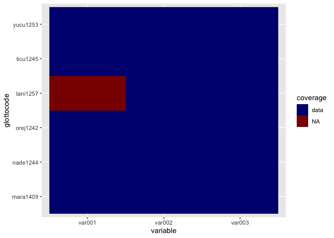

<!-- README.md is generated from README.Rmd. Please edit that file -->

# glottospace: Language Mapping and Geospatial Analysis of Linguistic and Cultural Data 

<!-- badges: start -->

[](https://lifecycle.r-lib.org/articles/stages.html#stable)
[](https://www.gnu.org/licenses/gpl-3.0)
[](https://github.com/SietzeN/glottospace/actions)
[](https://joss.theoj.org/papers/c93a1ccb6835a15c6026ea1ddc28b50c)
<!-- badges: end -->

# Introduction

The **glottospace** package facilitates the geospatial analysis of
linguistic and cultural data. The aim of this package is to provide a
streamlined workflow for working with spatio-linguistic data, including
data import, cleaning, exploration, visualization and export. For
example, with **glottospace** you can quickly match your own linguistic
data to a location and plot it on a map. You can also calculate
distances between languages based on their location or linguistic
features and visualize those distances. In addition, with
**glottospace** you can easily access global databases such as
[glottolog](https://glottolog.org/), [WALS](https://wals.info/) and
[D-PLACE](https://d-place.org/) from R and integrate them with your own
data.

# Development

We’re still actively developing the **glottospace** package by adding
new functions and improving existing ones. Although the package is
stable, you might find bugs or encounter things you might find
confusing. You can help us to improve the package by:

-   Sending an email to [Sietze
    Norder](mailto:s.j.norder@hum.leidenuniv.nl) with a clear
    description of the issue or error message.  
-   Opening a new issue in the [glottospace issues page on
    GitHub](https://github.com/SietzeN/glottospace/issues)
-   Fixing a bug or adding functionality and submit a [pull request on
    GitHub](https://github.com/SietzeN/glottospace/pulls).

# Citation

We’re currently writing a paper about the package presenting its full
functionality. If you find the **glottospace** package useful, please
cite it in your work:

    #> 
    #> To cite glottospace in publications use:
    #> 
    #>   Norder, S.J. et al. (2022). glottospace: R package for the geospatial
    #>   analysis of linguistic and cultural data. URL
    #>   https://github.com/SietzeN/glottospace.
    #> 
    #> A BibTeX entry for LaTeX users is
    #> 
    #>   @Unpublished{,
    #>     title = {glottospace: R package for the geospatial analysis of linguistic and cultural data},
    #>     author = {Sietze Norder},
    #>     note = {Manuscript under preparation},
    #>     url = {https://github.com/SietzeN/glottospace},
    #>   }

The package uses two global databases:
[glottolog](https://glottolog.org/) and [WALS](https://wals.info/). In
addition, **glottospace** builds on a combination of
[spatial](https://www.r-pkg.org/ctv/Spatial) and non-spatial packages,
including **sf**, **terra**, **tmap**, **mapview**, **rnaturalearth**,
and **dplyr**. If you use **glottospace** in one of your publications,
please cite these data sources and packages as well.

# Installation

You can install the latest release of glottospace from
[CRAN](https://CRAN.R-project.org/package=glottospace) with:

``` r
# install.packages("glottospace")
# If you receive the message 'loading failed for 'i386', you can try:
# install.packages("glottospace", INSTALL_opts = "--no-multiarch")
```

You can install the development version of glottospace from
[GitHub](https://github.com/) with:

``` r
# install.packages("devtools")
# devtools::install_github("SietzeN/glottospace", INSTALL_opts=c("--no-multiarch"))
```

# Example

Before describing the functionality of **glottospace**, we give a quick
demonstration of a typical workflow.

## Plotting language locations on a map

Imagine you’re working with languages in a particular region, and want
to visualize them on a map. With glottospace this is easy! You could for
example filter all languages in South America, and show which ones of
them are isolate languages:

``` r
library(glottospace)

## Plot point data:
glottomap(continent = "South America", color = "isolate")
```


Languages are often represented with points, while in reality the
speakers of a language can inhabit vast areas. glottospace works with
point and polygon data. When polygon data is not available, you can
interpolate the points and plot those.

``` r
## Filter by continent
glottopoints <- glottofilter(continent = "South America")
# Interpolate points to polygons:
glottopols <- glottospace(glottopoints, method = "voronoi")
# Plot polygon data:
glottomap(glottodata = glottopols, color = "family_size_rank")
```


# Workflow of glottospace

The glottospace package offers a wide range of functions to work with
spatio-linguistic data. The functions are organized into the following
function families, of which the core function generally has the same
name as the family to which it belongs:

1.  glottoget: download glottodata from remote server, or load locally
    stored glottodata.

2.  glottocreate: create empty glottodata structure, to add data
    manually.

3.  glottocheck: run interactive quality checks of user-provided
    glottodata.

4.  glottoclean: clean-up glottodata.

5.  glottojoin: join user-provided glottodata with other (often online)
    datasets.

6.  glottosearch: search [glottolog](https://glottolog.org/) database
    for languages, language families, glottocodes, etc.

7.  glottofilter: filter/subset glottodata based on linguistic and
    geographic features/variables.

8.  glottodist: calculate differences/similarities between languages
    based on their features (linguistic, cultural, environmental,
    geographic, etc.).

9.  glottoplot: visualizing differences/similarities between languages.

10. glottospace: make glottodata spatial, add coordinates, add spatial
    points or polygons to languages.

11. glottomap: visualize linguistic and cultural data on a map.

12. glottosave: save output generated by glottospace (data, figures,
    maps, etc.).

## glottoget

You can load locally stored glottodata (for example from an excel file
or shapefile). The glottospace package has two built-in artificial demo
datasets (“demodata” and “demosubdata”).

``` r
glottodata <- glottoget("demodata")
head(glottodata)
#>   glottocode var001 var002 var003
#> 1   yucu1253      Y      a      N
#> 2   tani1257   <NA>      b      Y
#> 3   ticu1245      Y      a      Y
#> 4   orej1242      N      b      N
#> 5   nade1244      N      c      Y
#> 6   mara1409      N      a      N
```

You can also load glottodata from online databases such as
[glottolog](https://glottolog.org/). You can download a raw version of
the data (‘glottolog’), or an enriched/boosted version (‘glottobase’):

``` r
# To load glottobase:
glottobase <- glottoget("glottobase")
colnames(glottobase)
#>  [1] "glottocode"       "name"             "macroarea"        "isocode"         
#>  [5] "countries"        "family_id"        "classification"   "parent_id"       
#>  [9] "family"           "isolate"          "family_size"      "family_size_rank"
#> [13] "country"          "sovereignty"      "type"             "geounit"         
#> [17] "continent"        "adm0_a3"          "geometry"
```

## glottocreate

You can generate empty data structures that help you to add your own
data in a structured way. These data structures can be saved to your
local folder by specifying a filename (not demonstrated here).

``` r
glottocreate(glottocodes = c("yucu1253", "tani1257"), variables = 3, meta = FALSE)
#>   glottocode var001 var002 var003
#> 1   yucu1253     NA     NA     NA
#> 2   tani1257     NA     NA     NA
```

We’ve specified meta = FALSE, to indicate that we want to generate a
‘flat’ glottodata table. However, when creating glottodata, by default,
several meta tables are included:

``` r
glottodata_meta <- glottocreate(glottocodes = c("yucu1253", "tani1257"), variables = 3)
summary(glottodata_meta)
#>              Length Class      Mode
#> glottodata    4     data.frame list
#> structure     6     data.frame list
#> description  11     data.frame list
#> references    9     data.frame list
#> remarks       5     data.frame list
#> contributors  5     data.frame list
#> sample        3     data.frame list
#> readme        2     data.frame list
#> lookup        2     data.frame list
```

The majority of these meta tables are added for the convenience of the
user. The ‘structure’ table is the only one that is required for some of
the functions in the glottospace package. A structure table can also be
added later:

``` r
glottocreate_structuretable(varnames = c("var001", "var002", "var003"))
#>   varname type levels weight group subgroup
#> 1  var001   NA     NA      1    NA       NA
#> 2  var002   NA     NA      1    NA       NA
#> 3  var003   NA     NA      1    NA       NA
```

More complex glottodata structures can also be generated. For example,
in cases where you want to distinguish between groups within each
language.

``` r
# Instead of creating a single table for all languages, you might want to create a list of tables (one table for each language)
glottocreate(glottocodes = c("yucu1253", "tani1257"), 
                     variables = 3, groups = c("a", "b"), n = 2, meta = FALSE)
#> $yucu1253
#>     glottosubcode var001 var002 var003
#> 1 yucu1253_a_0001     NA     NA     NA
#> 2 yucu1253_a_0002     NA     NA     NA
#> 3 yucu1253_b_0001     NA     NA     NA
#> 4 yucu1253_b_0002     NA     NA     NA
#> 
#> $tani1257
#>     glottosubcode var001 var002 var003
#> 1 tani1257_a_0001     NA     NA     NA
#> 2 tani1257_a_0002     NA     NA     NA
#> 3 tani1257_b_0001     NA     NA     NA
#> 4 tani1257_b_0002     NA     NA     NA
#> 
#> attr(,"class")
#> [1] "glottosubdata" "list"
```

## glottocheck

If you have your own data, you might want to do some interactive quality
checks:

``` r
glottodata <- glottoget("demodata")
glottocheck(glottodata, diagnostic = FALSE)
#> No missing IDs
#> No duplicate IDs.
#> All variables have two or more levels (excluding NA)
#> Checking 6 glottocodes...
#> All IDs are valid glottocodes
#> Some columns have missing data.
#> Some rows have missing data.
#> glottodata does not contain metadata
```

We’ve now specified diagnostic = FALSE, but the default is to show some
more extensive diagnostics (like a data coverage plot).

You can also check the metadata:

``` r
glottodata <- glottoget(glottodata = "demodata", meta = TRUE)
glottocheck(glottodata, checkmeta = TRUE)
#> No missing IDs
#> No duplicate IDs.
#> All variables have two or more levels (excluding NA)
#> Checking 6 glottocodes...
#> All IDs are valid glottocodes
#> Some columns have missing data.
#>       var001
#> count      1
#> Some rows have missing data.
#>          count
#> tani1257     1
#> This glottodataset contains the folowing tables: glottodata, structure, description, references, remarks, contributors, sample, readme, lookup
#> All types recognized
#> All weights are specified
#> The following variables are in the data, but there are no such columns variables defined in the structure table: glottocode
#>  Please check whether the spelling is identical, remove the rows from the structure table, or add the columns to the data.
```



## glottoclean

Once you’ve loaded glottodata, you might encounter some inconsistencies.
For example, data-contributors might not have used a standardized way of
coding missing values.

``` r
glottodata <- glottoget(glottodata = "demodata", meta = TRUE)
glottodata$structure
#>   varname   type levels weight group subgroup
#> 1  var001   symm     NA      1    NA       NA
#> 2  var002 factor     NA      1    NA       NA
#> 3  var003   symm     NA      1    NA       NA
# glottodata <- glottoclean(glottodata)
```

## glottojoin

Join user-provided glottodata with other datasets, or with online
databases.

``` r
# Join with glottospace
glottodata <- glottoget("demodata")
glottodatabase <- glottojoin(glottodata, with = "glottobase")
glottodataspace <- glottojoin(glottodata, with = "glottospace")

# Join a list of glottodata tables into a single table
glottodatalist <- glottocreate(glottocodes = c("yucu1253", "tani1257"), 
                                       variables = 3, groups = c("a", "b"), n = 2, meta = FALSE)
glottodatatable <- glottojoin(glottodata = glottodatalist)
```

## glottosearch

As demonstrated in the example above, you can search glottodata for a
specific search term

You can search for a match in all columns:

``` r
glottosearch(search = "yurakar")
#> Simple feature collection with 1 feature and 18 fields
#> Geometry type: POINT
#> Dimension:     XY
#> Bounding box:  xmin: -65.1224 ymin: -16.7479 xmax: -65.1224 ymax: -16.7479
#> Geodetic CRS:  WGS 84
#>      glottocode     name     macroarea isocode countries family_id
#> 7555   yura1255 Yuracaré South America     yuz        BO  yura1255
#>      classification parent_id   family isolate family_size family_size_rank
#> 7555           <NA>      <NA> Yuracaré    TRUE           1                1
#>      country sovereignty              type geounit     continent adm0_a3
#> 7555 Bolivia     Bolivia Sovereign country Bolivia South America     BOL
#>                       geometry
#> 7555 POINT (-65.1224 -16.7479)
```

Or limit the search to specific columns:

``` r
glottosearch(search = "Yucuni", columns = c("name", "family"))
#> Simple feature collection with 2 features and 18 fields
#> Geometry type: POINT
#> Dimension:     XY
#> Bounding box:  xmin: -97.91818 ymin: -0.76075 xmax: -71.0033 ymax: 17.23743
#> Geodetic CRS:  WGS 84
#>      glottocode              name     macroarea isocode countries family_id
#> 7541   yucu1253            Yucuna South America     ycn  BR;CO;PE  araw1281
#> 7542   yucu1254 Yucunicoco Mixtec North America                MX  otom1299
#>                                                      classification parent_id
#> 7541                            araw1281/japu1236/nucl1764/yucu1252  yucu1252
#> 7542 otom1299/east2557/amuz1253/mixt1422/mixt1423/mixt1427/sout3179  sout3179
#>           family isolate family_size family_size_rank  country sovereignty
#> 7541    Arawakan   FALSE          77               42 Colombia    Colombia
#> 7542 Otomanguean   FALSE         181               46   Mexico      Mexico
#>                   type  geounit     continent adm0_a3
#> 7541 Sovereign country Colombia South America     COL
#> 7542 Sovereign country   Mexico North America     MEX
#>                        geometry
#> 7541  POINT (-71.0033 -0.76075)
#> 7542 POINT (-97.91818 17.23743)
```

Sometimes you don’t find a match:

``` r
glottosearch(search = "matsigenka")[,"name"]
#> Simple feature collection with 0 features and 1 field
#> Bounding box:  xmin: NA ymin: NA xmax: NA ymax: NA
#> Geodetic CRS:  WGS 84
#> [1] name     geometry
#> <0 rows> (or 0-length row.names)
```

If you can’t find what you’re looking for, you can increase the
tolerance:

``` r
glottosearch(search = "matsigenka", tolerance = 0.2)[,"name"]
#> Simple feature collection with 1 feature and 1 field
#> Geometry type: POINT
#> Dimension:     XY
#> Bounding box:  xmin: -74.4371 ymin: -11.5349 xmax: -74.4371 ymax: -11.5349
#> Geodetic CRS:  WGS 84
#>               name                  geometry
#> 4787 Nomatsiguenga POINT (-74.4371 -11.5349)
```

Aha! There it is: ‘Machiguenga’

``` r
glottosearch(search = "matsigenka", tolerance = 0.4)[,"name"]
#> Simple feature collection with 12 features and 1 field
#> Geometry type: POINT
#> Dimension:     XY
#> Bounding box:  xmin: -74.4371 ymin: -14.9959 xmax: 166.738 ymax: 13.5677
#> Geodetic CRS:  WGS 84
#> First 10 features:
#>                    name                   geometry
#> 1710 Eastern Maninkakan   POINT (-10.5394 9.33048)
#> 3063    Kita Maninkakan   POINT (-9.49151 13.1798)
#> 3147   Konyanka Maninka   POINT (-8.89972 8.04788)
#> 3731   Maasina Fulfulde   POINT (-3.64763 11.1324)
#> 3747        Machiguenga  POINT (-72.5017 -12.1291)
#> 3901           Mandinka POINT (-15.65395 12.81652)
#> 3937          Mansoanka   POINT (-15.9202 12.8218)
#> 4040  Matigsalug Manobo     POINT (125.16 7.72124)
#> 4787      Nomatsiguenga  POINT (-74.4371 -11.5349)
#> 5383         Piamatsina   POINT (166.738 -14.9959)
```

## glottofilter

filter, select, query

``` r
eurasia <- glottofilter(continent = c("Europe", "Asia"))
wari <- glottofilter(glottocode = "wari1268")
indo_european <- glottofilter(family = 'Indo-European')
south_america <- glottofilter(continent = "South America")
colovenz <- glottofilter(country = c("Colombia", "Venezuela"))
# arawtuca <- glottofilter(expression = family %in% c("Arawakan", "Tucanoan"))
```

## glottodist

Quantify differences and similarities between languages glottodistances:
calculating similarities between languages based on linguistic/cultural
features

``` r
# In order to be able to calculate linguistic distances a structure table is required, that's why we specify meta = TRUE.
glottodata <- glottoget("demodata", meta = TRUE)
glottodist <- glottodist(glottodata = glottodata)
#> Values in binary columns (symm/asymm) recoded to TRUE/FALSE
#> Missing values recoded to NA
#> All variables have two or more levels (excluding NA)
#> All variables have two or more levels (excluding NA)

# As we've seen above, in case you have glottodata without a structure table, you can add it:
glottodata <- glottoget("demodata", meta = FALSE)
structure <- glottocreate_structuretable()
glottodata <- glottocreate_addtable(glottodata, structure, name = "structure")
```

## glottoplot

Visualizing differences (distances) between languages based on
linguistic, cultural, and environmental features.

``` r
glottodata <- glottoget("demodata", meta = TRUE)
glottodist <- glottodist(glottodata = glottodata)
#> Values in binary columns (symm/asymm) recoded to TRUE/FALSE
#> Missing values recoded to NA
#> All variables have two or more levels (excluding NA)
#> All variables have two or more levels (excluding NA)
glottoplot(glottodist = glottodist)
```


## glottospace

This family of functions turns glottodata into a spatial object. As
we’ve illustrated above, these can be either glottopoints or glottopols

``` r
glottodata <- glottoget("demodata")
glottospacedata <- glottospace(glottodata, method = "buffer", radius = 5)
#> Buffer created with a radius of 5 km.
# By default, the projection of maps is equal area, and shape is not preserved:
glottomap(glottospacedata)
```


## glottomap

With glottomap you can quickly visualize the location of languages.
Below we show simple static maps, but you can also create dynamic maps
by specifying type = “dynamic”.

To select languages, you don’t need to call glottofilter() first, but
you can use glottomap() directly. Behind the scenes glottomap() passes
those arguments on to glottofilter().

``` r
glottomap(country = "Colombia")
```


However, you can also create maps with other glottodata. For example, we
might want to create a world map highlighting the largest language
families

``` r
# glottodata <- glottoget()
# families <- dplyr::count(glottodata, family, sort = TRUE)
# 
# # highlight 10 largest families:
# glottodata <- glottospotlight(glottodata = glottodata, spotcol = "family", spotlight = families$family[1:10], spotcontrast = "family", bgcontrast = "family")
# 
# # Create map
# glottomap(glottodata, color = "color")
```

## glottosave

All output generated with the glottospace package (data, figures, maps,
etc.) can be saved with a single command.

``` r
glottodata <- glottoget("demodata", meta = FALSE)
# Saves as .xlsx
# glottosave(glottodata, filename = "glottodata") 

# Saves as .GPKG
glottospacedata <- glottospace(glottodata)
# glottosave(glottodata, filename = "glottodata") 

# By default, static maps are saved as .png, dynamic maps are saved as .html
glottomap <- glottomap(glottodata)
# glottosave(glottomap, filename = "glottomap") 
```
