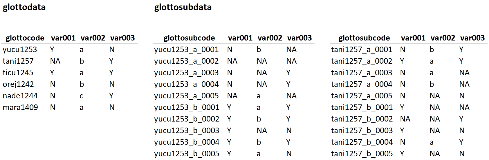

# Summary

The glottospace R package facilitates the geospatial analysis of linguistic and cultural data. The aim of the package is to provide a streamlined workflow for geolinguistic analysis, including data entry, data import, cleaning, exploration, language mapping and visualisation, and export. Glottospace is also intended as an R interface to global linguistic and cultural databases such as Glottolog, WALS, and D-PLACE, contributing to improved reproducibility of data analysis.

# Statement of need

Several databases exist that capture aspects of linguistic and cultural diversity globally. However, there is a lack of interfaces to access and manipulate these databases, specifically within the R environment [@RCoreTeam:2022]. For example to link these databases with data collected by researchers at smaller scales or particular sets of languages. While  linguistic R packages have been developed for specific purposes (e.g. lingtypR [@Becker:2022], qlcData [@Cysouw:2018], lingtypology [@Moroz:2017], and glottoTrees [@Round:2021]), there is currently no easy-to-use package that automates the most common tasks related to analysing, visualising, and mapping (geo)linguistic data. **glottospace** aims to fill this gap by offering a set of functions that, in essence, provide four things: 

1.	Simplified access to global linguistic and cultural databases
1.	Standardized data structures for data collection, import, cleaning, and checking
1.	Functionalities to merge data from various linguistic and cultural datasets
1.	Streamlined workflows for geolinguistic data analysis and visualisation

We will now describe each of these elements in more detail.

Existing global databases of linguistic and cultural diversity, such as Glottolog [@Hammarström:2021], WALS [@Dryer:2013], and D-PLACE [@Kirby:2016], are structured according to the cross-linguistic data format [@Forkel:2018], allowing for the integration of different databases. One way in which languages can be matched across databases is by using glottocodes, i.e. unique identifiers of languages, dialects and language families [@Forkel:2021]. These glottocodes often have geospatial coordinates associated with them, allowing for geospatial analysis and visualisation. With **glottospace**, users can easily access the most recent version of these databases. Researchers can query those databases, use them as a benchmark, or supplement their own data with additional information (like geospatial coordinates, language family).  

The **glottospace** package can generate empty data structures to facilitate data entry, or convert existing databases (for example stored in an Excel or CSV file) into two standardized data structures (\autoref{fig:data}): 

  - glottodata: a single data table (and optionally, metadata tables)
  
    - one row for each glottocode
    
    - any number of columns with linguistic/cultural features
    
  - glottosubdata: multiple data tables (and optionally, metadata tables)
  
    - one table for each glottocode
    
      - one row for each glottosubcode
      
      - any number of columns with linguistic/cultural features

The glottodata structure is appropriate when one wants to assign one or more features to each language in the dataset (as e.g. in WALS). The glottosubdata structure allows for assigning more complex structures (inventories) to each language in the dataset, which may vary in size from one language to another, such as phoneme inventories (Phoible;  [@Moran:2019] construction/morphological inventories (AUTOTYP; [@Bickel:2022], and subordination strategies in SAILS [@vanGijn:2016]. 

Although all metadata tables that can be generated for glotto(sub)data are optional, some of these tables can greatly facilitate the automation and reproducibility of further analysis. Examples of metadata tables that can be generated by **glottospace** are:

  - structure table: specify the type, possible levels, weight, group, and subgroup for each variable
  
  - description table: provide a description, reference, and remark for each variable
  
  - references table: provide a reference and page number for each glottocode (or variable)
  
  - remarks table: provide additional remarks for each glottocode (or variable)
  
  - contributors table: add the names of people who contributed the data 
  
  - sample: specify a subset of glottocodes that should be used in further analysis
  
  - readme: add information about the person responsible for the data, including contact details and how to cite the data.
  

The glottodata and glottosubdata structures are optimized to be linked with the aforementioned global databases, and allow for streamlined workflows for the analysis and visualisation of linguistic and cultural data. For example, with one line of code, glottospace users can map a set of languages as either points or polygons, and colour them by a particular feature. However, language mapping and visualisation is just one aspect of the package’s functionality, the aim of **glottospace** is to streamline entire workflows, facilitating common tasks such as: 

  -	read user data from a local path
  
  -	convert data into glottodata or glottosubdata structures
  
  -	perform quality checks and data cleaning (e.g. missing values, inconsistencies, undefined glottocodes, etc.)
  
  -	analyse languages and cultures based on relevant features (e.g. lexicon, phonemes, gender roles, subsistence strategies, etc.)
  
  -	create different kinds of maps and visualisations for a set of languages
  
  -	export visualisations, maps, and datasets to be used in publications (\autoref{fig:map})
  
  -	improve reproducibility in data analysis
  

![Isolate languages in South America, with major rivers in the background. This visualisation is generated with **glottospace** using one line of code. Although other map projections are supported, the default projection is the equal-area Eckert IV projection (following [@McNew:2019]).  \label{fig:map}](joss_map.png)

To enable this functionality, **glottospace** builds on a combination of spatial and non-spatial packages, including sf [@Pebesma:2018], tmap [@Tennekes:2018], rnaturalearth [@South:2017], ggplot2 [@Wickham:2016], vegan [@Oksanen:2020], and dplyr [@Wickham:2021]. The package is currently used by researchers and students in the field of comparative and areal linguistics as well as language typology and cultural anthropology. Furthermore, we are planning to use the package for classroom teaching. 

# Acknowledgements
Sietze Norder, Leonardo Arias, and Rik van Gijn were supported by the European Research Council under the EU H2020 and Research and Innovation program (SAPPHIRE grant 818854). The authors would like to thank Simon Greenhill, Robert Forkel and Harald Hammarström for brainstorming about linguistic data formats and the functionality of the package. 

# References

